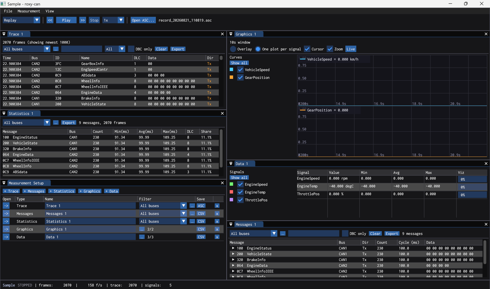

# roxy-can

一个基于 Rust + Dear ImGui 的 CAN 总线分析工具，界面与交互参考 CANoe。总线数量不固定，可在 **Buses** 窗口中增删并自定义名称，每条总线各挂一个 DBC；Data/Graphics 窗口是纯信号观测器，可跨总线混合选择信号。虚拟模式下总线默认空闲，报文由内置信号生成器（Interactive Generator）产生；帧模型覆盖经典 CAN、**CAN FD**（变长载荷至 64 字节、BRS/ESI 标志）、以及错误帧 / 远程帧，支持 DBC 解码，以及与 Vector/CANoe 兼容的 ASC 录制与 ASC/BLF 回放（大文件走 mmap 流式加载）。



## 功能

- **CAN FD / 错误帧 / 远程帧帧模型**：载荷变长至 64 字节，DLC 码与真实字节长度分离，FD 帧携带 BRS / ESI 标志；同时识别经典 CAN 的错误帧（`e` 类型）与远程帧（`r` 类型），并在 Trace 中给错误行铺红底、远程行铺淡紫底；Trace / Messages / Statistics 共用一个 `Flags` 列显示 `FD` / `FD·B` / `FD·E` / `FD·BE` / `ERR` / `RTR`；错误帧不进入 Messages / Statistics 聚合，远程帧的 payload 视为空；经典 CAN 数据帧行为完全向后兼容
- **动态总线**：Buses 窗口（View → Buses）中可添加/删除总线、自定义总线名、为每条总线单独加载 DBC；删除总线时所有观测器、过滤器、生成器自动重映射
- **Interactive Generator（信号生成器）**：所有总线的 DBC 报文即开即用，支持按周期发送、按信号拖拽编辑物理值（自动编码为数据字节）或按 hex 编辑；每条报文带 FD 勾选（DBC 报文 >8 字节时自动置为 FD），hex 编辑最多 64 字节；搜索框按名称/ID 过滤，每条总线可一键 All On / All Off
- **Trace / Messages / Statistics 均可多开**：在 Measurement Setup 中用 +Trace / +Messages / +Statistics 新建，每个窗口有独立的过滤设置
- **Signals 选项**：每个观测器一个 Signals 下拉框，三档可选——所有总线、某一条总线、Manual（手动勾选，各窗口的勾选项互相独立）；选 "…" 打开 Message Selection 弹窗，按报文勾选，勾选即切换为 Manual，Clear 恢复为所有总线
- **Trace 视图**：逐帧滚动显示，含时间、总线、ID、报文名、数据、方向（Tx 高亮），支持 Signals 范围 + 文本/方向/DBC-only 过滤；点列头可按该列排序（第三次点击恢复默认新→旧）；右键行可快速过滤该 ID、清除过滤、加入生成器或复制整行/ID，可按当前过滤导出 ASC
- **Messages 聚合视图**：按（总线, ID）聚合，显示计数、实测周期、最新数据，展开可查看 DBC 解码后的信号值
- **Statistics 视图**：每报文计数、周期 Min/Avg/Max、长度（字节数）、总线占比
- **Data/Graphics 窗口即信号观测器**：不绑定具体总线，信号选择全部在 Measurement Setup 的 Filter 列完成；窗口本体只保留已选信号列表（可逐个开关显示/绘制、拖拽排序）；支持多窗口；Data 窗口值表含 Min/Avg/Max 统计列，可视化列在数值条与 Sparkline 之间点击切换；Graphics 窗口顶部一排时间窗口按钮（1s/5s/10s/30s/1m/5m/30m）点选即换，Zoom 默认关闭，勾选后滚轮缩放/拖动平移，Live 回到实时边缘
- **Measurement Setup**：所有观测器（Trace/Messages/Statistics/Graphics/Data）一张表总览——顶部按钮新增任意观测器；每行一个方形 "->" 按钮，点击即打开并跳转到对应窗口（无关闭功能，关闭窗口用窗口自身的 X）；可重命名、逐个导出（Trace 按当前过滤器导出 ASC，其余导出 CSV），并可删除任意观测器；Trace/Messages/Statistics 行内选择 Signals 范围，Graphics/Data 行的 "…" 打开 Signal Selection 弹窗——报文 → 信号两级复选树（总线仅作分组标题，可跨总线任意勾选），报文级可整体勾选/取消，标签带（已选/总数）计数，支持搜索
- **Network 视图**：每条总线一段拓扑（DBC 节点框 + CAN 总线）；绿点表示实时活动，点击节点查看收发详情（详情在独立滚动面板中）
- **信号列表**：支持拖拽排序、全部显示；批量添加信号在 Signal Selection 弹窗中完成（报文级复选框整体勾选）
- **ASC / BLF 录制与回放（Vector/CANoe 兼容）**：读写标准 Vector ASC（`base hex` / `timestamps absolute`），经典数据帧走 `d` 型行、错误帧走 `e` 型行、远程帧走 `r` 型行，FD 帧按逐行 `CANFD` 记录，导出的 `.asc` 可被 CANoe / python-can 打开，CANoe 导出的经典、FD、错误/远程日志亦可导入；同时能直接读取 CANoe 默认落盘的 `.blf`（`BLF4` 头 + `LOBJ` 对象，raw 与 zlib 压缩容器均支持，CAN_MESSAGE / _2 / _FD / _FD_64 / _ERROR_EXT 全覆盖），时间戳按首帧归零，与 ASC 的相对时间约定一致；≥100 MB 的 ASC 自动切至 mmap 流式读取，BLF 全程走 mmap，RSS 与日志大小解耦；录制文件名自动带日期时间戳；加载日志（Open Log...）与开始回放分开——加载只解析就绪，Play（Replay 模式）才开始播放；工具栏为播放器式走带控制：**<< / Play·Pause / >> / Stop**，`<<` `>>` 逐级放慢/加快，Stop 后的倍速下拉（0.5x / 1x / 2x / 4x）直接选择，回放中切换立即生效；走带行内嵌**可拖动时间轴**，拖到任意时刻即时定位，前向向后皆可，拖动过程中逐帧响应（稀疏索引随回放惰性生长，打开日志仍是 O(1)；代价是全新加载后第一次大跨度拖动要先扫过前缀，之后同一跳转即为瞬时）；日志播完后仍可拖回中途再按 Play 原地续播，`Stop` 则表示下次从头重放；回放时状态栏显示日志文件名 + 当前时间 / 总时长；日志路径留空可直接回放最近一次录制
- **拖放打开 / 最近文件**：把 `.dbc` / `.asc` / `.blf` 文件拖到窗口即可打开（DBC 装入第一条总线，日志切至 Replay 模式）；File 菜单提供 Recent DBC / Recent Logs 列表
- **状态栏**：当前工程名（有未保存修改时带 `*`）、测量状态、帧率 (f/s)、帧计数、录制指示；回放时显示日志文件名 + 当前时间 / 总时长（播完后不再消失，便于配合时间轴回拖）
- **多 Desktop**：类 CANoe 的多桌面——每个桌面各自记住五类观测窗口（Trace/Messages/Statistics/Graphics/Data）的开关与布局，以及全局面板（Generator/Network/Measurement Setup/Buses/ID Filter）的显示状态；底部桌面标签栏一键切换，`+` 新建空白桌面，右键标签可重命名、删除或调整顺序（Move to 选择目标位次，至少保留一个）；桌面列表与活动桌面随工程文件保存
- **工程文件（.rxproj）**：类 CANoe 的工程文件——总线数量/名称与各总线 DBC、全部观测窗口及其过滤设置、已选信号、生成器配置、窗口布局/停靠全部打包在一个 JSON 工程文件里；File 菜单提供 New / Open / Recent Projects / Save / Save As；DBC 路径相对工程目录存储，工程文件夹可整体移动；已保存工程退出时自动覆盖，未保存（Untitled）工程仅在有修改时于退出或切换时弹框询问（未改动则静默通过）；New Project 创建完全空的工程（无 DBC、无观测窗口、无生成器条目）；上次打开的工程自动恢复（`roxy-can.meta.json` 记录）；运行中每 30 秒写一份崩溃缓存（`roxy-can.autosave.rxproj`，不动工程文件本身），异常退出后下次启动自动恢复，正常退出时删除；旧版 `roxy-can.json` 在首次启动时自动迁移。窗口可停靠、可拖动；HiDPI 由平台层按 framebuffer scale 自动换算；字体沿用 roxy-dbc 的方案——内嵌 Inconsolata（13px、像素对齐）并合并系统中文字体字形，按基线自然对齐，支持中文输入法（IME）

## 快捷键

| 按键 | 功能 |
| --- | --- |
| F9 | 启动 / 停止测量（按工具栏 Simulation/Replay 下拉选择的模式启动） |
| Space | 播放 / 暂停（未运行时启动，同 Play 按钮） |
| - / + | 回放减速 / 加速一档 |
| Home | 图形窗口回到实时边缘（复位平移） |
| Ctrl+R | 切换 ASC 录制 |
| Ctrl+E | 导出第一个 Trace 窗口为 ASC |
| Ctrl+O | 打开 DBC |
| Ctrl+N | 新建工程 |
| Ctrl+Shift+O | 打开工程 |
| Ctrl+S | 保存工程 |
| Ctrl+Shift+S | 工程另存为 |

菜单栏 Help → Shortcuts 可随时查看全部快捷键，About 显示版本信息。

## 构建与运行

需要 Rust 工具链（edition 2024）。

```sh
cargo run
```

运行测试：

```sh
cargo test
```

## 使用

1. 用工具栏的 **Simulation / Replay** 下拉选择模式（切换时自动停止当前运行），点 **Play** 启动（同一按钮切换暂停/继续），`<<` `>>` 逐级调整回放倍速，**Stop** 停止：仿真模式跑虚拟总线，回放模式回放已加载的 ASC/BLF（未加载时弹出文件选择）；菜单栏 **File** 可打开 DBC/日志、导出与退出，**Measurement** 可启停/暂停，**View** 开关各面板（默认两条总线：CAN1 挂 `assets/sample.dbc`、CAN2 挂 `assets/motbus.dbc`）
2. 在 **Interactive Generator** 中勾选报文 **On** 产生总线流量（可展开按信号调整数值），报文按总线区分
3. **View → Buses** 管理总线：改名、**Open...** 为单条总线加载 DBC、**+ Add bus** 新增、**x** 删除；**Open Log...** 只加载日志（ASC 或 BLF），回放由 **Play** 启动；`<<` `>>` 逐级变倍速，Stop 后的倍速下拉直接选择（0.5x/1x/2x/4x）；倍速下拉右侧的**时间轴可拖动定位**到任意时刻（暂停时拖完再 Play 从落点继续；日志播完后拖回去再按 Play 会原地续播，按 **Stop** 再 Play 才从头重放）；**回放进行中不能更换日志**——`Open Log...` 与 Recent Logs 会置灰，需先 **Stop**（Stop 后换日志会强制从头打开新文件，不会续播上一个）
4. 勾选 **Record** 录制 ASC；**Measurement Setup** 表里可总览所有观测器，点 "->" 打开并跳转到对应窗口，并在此新增/删除各类窗口、逐个导出
5. 每个观测器行内选择 **Signals** 范围（所有总线 / 单条总线 / Manual），Manual 时点 "…" 在 Message Selection 弹窗中勾选报文
6. Data/Graphics 的信号选择在 Measurement Setup 行内点 "…" 打开 Signal Selection 弹窗勾选（按总线分组，可跨总线选择）；窗口本体只显示已选信号列表，可逐个开关

## 主要依赖

- [imgui-rs](https://github.com/imgui-rs/imgui-rs) + imgui-wgpu：界面与渲染
- [winit](https://github.com/rust-windowing/winit)：窗口与输入
- [can-dbc](https://github.com/marcelbuesing/can-dbc)：DBC 解析
- [rfd](https://github.com/PolyMeilex/rfd)：原生文件对话框
- [memmap2](https://github.com/Razaek/memmap2-rs)：ASC/BLF 大文件 mmap 流式读取
- [flate2](https://github.com/emoryns/rust-flate2)（rust_backend）：BLF zlib 压缩容器解压

## 许可

GPL-3.0，详见 [LICENSE](LICENSE)。
