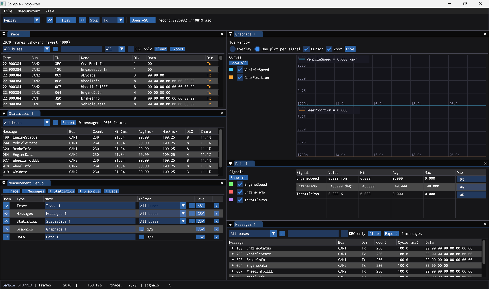

# roxy-can

基于 Rust + Dear ImGui 的 CAN / FlexRay 总线分析工具：多总线、每条总线各挂一份 DBC，覆盖经典 CAN、CAN FD、错误帧与远程帧，支持 Vector 硬件挂接、与 Vector 工具链兼容的 ASC / BLF 录制与回放，以及类 CAPL 的仿真节点脚本。Windows x64 可执行文件见 [Releases](https://github.com/chemPolonium/roxy-can/releases)。



完整操作语义见 [docs/usage.md](docs/usage.md)，这一页只说有什么。

## 功能

- **动态总线**：数量不固定，在 Buses 窗口增删、改名，每条总线单独挂 DBC；删除总线时观测器、过滤器与生成器条目自动跟着重映射。
- **DBC 解码**：复用报文只解当前那一组；值表显示枚举文本；浮点信号按位模式解码并带类型标记。
- **帧模型**：经典 CAN、CAN FD（变长载荷至 64 字节、BRS / ESI）、错误帧、远程帧。Trace 的 Flags 列统一给帧类型，错误行与远程行有底色。
- **观测窗口**：Trace / Messages / Statistics / Data / Graphics 每类都能多开、各自独立过滤；Data / Graphics 可跨总线勾选信号。
- **Trace**：虚拟滚动（几十万行的过滤结果照样流畅），payload 字节搜索、信号值条件（`Name>10`）、精确地址（`id:1AB` / `slot:13`）、时间范围、列头排序、右键"Filter this ID"、行游标 A/B 与 Δt 读数、点一行选中后用 ↑/↓ 走行、Ctrl+C 复制。
- **总线负载与规格监视**：按总线给线上一帧占时加权的负载与帧率（1 s 滚动窗）、60 s 负载曲线、错误帧计数；Specification 把实测流量与数据库声明逐条对账——Unknown / Dlc / Cycle / Missing 四类判定，容差与宽限可调，可导出 CSV。
- **Interactive Generator（节点中心）**：DBC 报文按声明周期发送，按信号拖物理值或直接改 hex；每个信号可挂 Ramp / Sine / Step / Random / Triangle / Counter 激励。条目都挂在 Network 的节点详情里，新建默认不发车，发不发逐条由你决定。
- **触发器**：条件有信号越阈、ID 出现、错误帧、周期超时、FlexRay 帧到达、FlexRay 信号越阈、系统变量越阈；动作可开始/停止录制（带预触发上下文与 post-roll）、发反应帧（触发帧的同名信号自动镜像过去）、插入标记、清空 Trace。
- **Network 视图**：每条总线一段拓扑，点节点看它的一切——角色（**模拟** / **离线**，缺省离线）、生成器条目、响应规则、绑定的脚本。
- **Profile 与硬件映射**：`profiles/<名>.toml` 存角色覆盖与硬件映射，配合 `--profile` 让同一份工程在仿真 / 台架 / CI 之间零修改切换；错配整份拒绝，绝不半套生效。
- **Kvaser / Vector 硬件挂接**：Buses 窗口选通道即挂；通道被别的程序占用时自动降级为只收并在行上标注；CAN FD 按总线的数据段波特率申请，硬件不支持就降级经典并标注。挂接期间收到的帧照常进所有视图，真实节点不必被模拟。发车被线路拒绝不再是静默的：第一次进 Write 窗口带驱动给的原因，之后只在 Buses 行上累计次数。
- **FlexRay**：可同时监听多路，每路一份自己的集群描述（FIBEX 2.x/3.x 或 AUTOSAR ARXML，中文编码无碍）。帧名与信号都按该路的描述解码，与 CAN 帧在 Trace 里按时间混排；Messages 逐帧给计数与周期均值±抖动，负载与规格照常判定；信号可订阅画曲线、进 State Tracker；帧到达与信号越阈都能作触发条件。**目前只收**：生成器条目与脚本发的 FlexRay 帧进本会话（所有视图与录制都看得见），但不出来线缆。
- **回放块**：依附于 DBC 节点——把该节点录制过的日志按 id 过滤后注回仿真总线，按录制间距发车，仿真 restbus 的落地方案。
- **仿真节点**：类 CAPL 的小语言编译执行，`on start` / `on message` / `on fr slot` / `on timer` / `on errorFrame` 事件驱动，读写 DBC 信号、收发帧、随机与波形内建。每个回调有指令预算，坏脚本卡不死总线，出错节点熔断停跑。可绑定到 DBC 节点，绑定后发车受该节点角色闸。编辑器三栏：处理器大纲、静态收发事实表、函数与报文速插。语言参考见 [docs/script_language.md](docs/script_language.md)，可运行示例见 `examples/`。
- **派生信号**：脚本 `emit_value("名", 表达式)` 一行发布，像数据库信号一样进 Graphics / Data / State Tracker。
- **系统变量**：CANoe 式的命名空间变量（初值 / 界限 / 单位 / 备注），专用窗口管理，脚本读写，同时发布为可观测流；每次测量开始复位为初值。
- **Monitor 监控面板**：轻量纯文本行，一行一个信号，行内阈值着色规则让"温度超 90 变红"这类告警一眼可见。
- **State Tracker**：对订阅信号的历史做状态分段——枚举标签、二进制方波、会话稳定配色，支持自定义区间与颜色钉住，碎带按最短显示时长合并，区段表可导出 CSV。
- **Write 窗口**：整系统一条滚动输出——节点 `print`、装配层检查与告警、熔断错误、命令事件分色带时间戳；可按类别过滤、导出文本。
- **录制与回放**：读写 Vector ASC 与 BLF（经典 / FD / 错误 / 远程帧，以及 FlexRay 收帧），自家录的文件放回去是同一批帧；`--convert` 纯流式转码。播放器式走带——倍速增减、as-fast-as-possible；回放按时间戳顺序调度，不做进度条随机跳转。录制支持 id 白名单过滤（CAN 写 hex、FlexRay 写 `FR0:13`）。
- **工程文件（.rxproj）**：总线与 DBC、观测窗口及过滤、信号选择、生成器配置、触发器、窗口布局全存一个 JSON；DBC 路径相对工程目录，工程文件夹可整体移动；30 秒自动保存。
- **多桌面**：多个桌面工作区，各自记住窗口开关与布局。
- **中文字体**：内嵌中文字形，支持中文输入法。

## 快捷键

| 按键 | 功能 |
| --- | --- |
| F9 | 启动 / 停止测量 |
| Space | 播放 / 暂停 |
| - / + | 回放减速 / 加速一档 |
| Home | 图形窗口回到实时边缘 |
| Ctrl+R | 切换录制 |
| Ctrl+E | 导出第一个 Trace 窗口为 ASC |
| Ctrl+O | 打开 DBC |
| Ctrl+N / Ctrl+Shift+O | 新建 / 打开工程 |
| Ctrl+S / Ctrl+Shift+S | 保存 / 另存工程 |

菜单栏 Help → Shortcuts 可查看全部快捷键。

## 构建与运行

需要 Rust 工具链（edition 2024）。

```sh
cargo run
```

运行测试：

```sh
cargo test
```

## 上手

1. 工具栏 **Simulation / Replay** 选模式，点 **Play**（仿真跑虚拟总线，回放已加载的 ASC / BLF）
2. **View → Buses** 给总线挂 DBC、挂日志、挂硬件；**View → Network** 把节点角色设为**模拟**，再到该节点的详情里逐条打开发要发的报文、调数值、挂激励
3. **Measurement Setup** 新增观测窗口、选信号范围、逐个导出；Data / Graphics 的信号在 Signal Selection 弹窗里跨总线勾选
4. 勾选 **Record** 开始录制
5. 挂了 DBC 之后，**View → Specification** 看实测流量与数据库声明的对账结果

## 命令行

脱离界面也能跑，适合放进 CI：

```sh
roxy-can --check-script <node.rxcan>            # 编译脚本，打印静态收发集与响应映射
roxy-can --project <p.rxproj> --duration 10 --stats out.csv   # 无头仿真整个工程
roxy-can --project <p.rxproj> --profile bench   # 叠加 profiles/bench.toml 的角色覆盖与硬件映射
roxy-can --convert <in.blf> <out.asc>           # 日志转码，保留 FlexRay 行
roxy-can --export-csv <in.blf> --dbc <a.dbc> --out signals.csv  # 按信号定义把日志导成 CSV
roxy-can --kvaser-probe                         # 列出 Kvaser 驱动可见的通道
roxy-can --vector-probe                         # 列出 Vector 通道，并逐口试开 FlexRay
roxy-can --vector-tx-probe 2                    # 打印该通道实际收到的驱动事件，用于核对发车结果
```

非零退出即失败。

## 文档

- [使用说明](docs/usage.md)：每个窗口的操作语义与统计口径
- [节点脚本语言参考](docs/script_language.md)：完整的语言手册
- [架构文档](docs/architecture.md)：线程模型、命令/快照边界与开发约定
- [路线建议](docs/roadmap.md)：定位取舍与脚本语言决策（建议，未立项）
- [TODO.md](TODO.md)：还没做的事

## 主要依赖

- [dear-imgui-rs](https://github.com/Latias94/dear-imgui-rs) + [dear-imgui-cte](https://crates.io/crates/dear-imgui-cte)：界面与渲染（ImGui 1.92 docking，源码编辑器为 ImGuiColorTextEdit）
- [winit](https://github.com/rust-windowing/winit)：窗口与输入
- [can-dbc](https://github.com/marcelbuesing/can-dbc)：DBC 解析
- [rfd](https://github.com/PolyMeilex/rfd)：原生文件对话框
- [memmap2](https://github.com/Razaek/memmap2-rs)：ASC/BLF 大文件流式读取
- [flate2](https://github.com/emoryns/rust-flate2)（rust_backend）：BLF zlib 容器解压

## 许可

GPL-3.0，详见 [LICENSE](LICENSE)。
